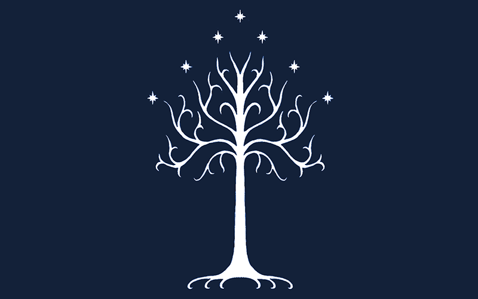

# Section notes for Week 7

No IPython Notebook today! Instead, download [Stanford Tregex 3.2.0](http://nlp.stanford.edu/downloads/tregex.shtml#Download) and the zipped Treebank corpus on the [course website](https://github.com/panand/ComputationalMethods). (We will do this together at the start today.) You can find this document in my repo at [http://github.com/obnorthrup/144coursework](http://github.com/obnorthrup/144coursework).

**Note:** There's no 'complete' version of this week's notes, so make sure you're saving your responses and writing comments as we go.

## Step 1: Setting up the tools

1. If you haven't already, download [Stanford Tregex 3.2.0](http://nlp.stanford.edu/downloads/tregex.shtml#Download).
2. Get the corpus from the [course website](https://github.com/panand/ComputationalMethods). *If you're on your own computer, just sync your local copy of the repo. Otherwise, download the whole site as a zip archive.*
3. Put these things somewhere.
4. Launch Tregex and load the appropriate part of the corpus.
5. Done!

## Step 2: Examine Penn Treebank

**But wait!** Let's look through some of the treebank by hand so we know what we're dealing with.

1. What are the 'tagged' files? The 'parsed' ones?
2. How are things labelled? ([Key](http://bulba.sdsu.edu/jeanette/thesis/PennTags.html))
3. What are the difficulties of building/maintaining a corpus like this?
4. Given these, what are the most important features of an annotated corpus?

## Step 3: Searching for structures

Use the `Pattern` field to say what you're looking for. Remember the syntax is different from what we've done before.

### Cheat sheet

    A < B      A immediately dominates B
    A << B     A dominates B
    A <- B     B is the last child of A
    A <<, B    B is a leftmost descendant of A
    A <<` B    B is a rightmost descendant of A
    A . B      A immediately precedes B
    A .. B     A precedes B
    A $ B      A and B are sisters
    A $. B     A and B are sisters and A immediately precedes B
    A $.. B    A and B are sisters and A precedes B

#### Problem A

1. Find the word "drive"
2. Find the noun "drive"
3. Find the verb "drive"
4. Find all conjugations of the verb "drive"

#### Problem B

1. Find the phrase "good and services"
2. Find all coordnations of two singular nouns.
3. Find all conjunctions of two singlar nouns.

#### Problem C

For each of these, find at least **two solutions**

1. Find the posessive marker
2. Find all the plural possessives
3. Match the noun phrase containing the posessor noun phrase

### Cheat sheet pt 2

    A !< B        A does not immediately dominate B
    A < !B        A immediately dominates anything but B
    A < B | < C   A immediately dominates B or C

#### Problem D

1. Find passive VPs with the verb `chosen'
2. Be careful not to overmatch…
3. Generalize to all passive verbs 

#### Problem E

**You tell me!** What shall we look for?

*This document draws from several sources, including [this presentation](https://files.ifi.uzh.ch/cl/volk/treebank_course/L01_Welcome_n_Overview.pdf) and Stanford's Tregex documentation.*